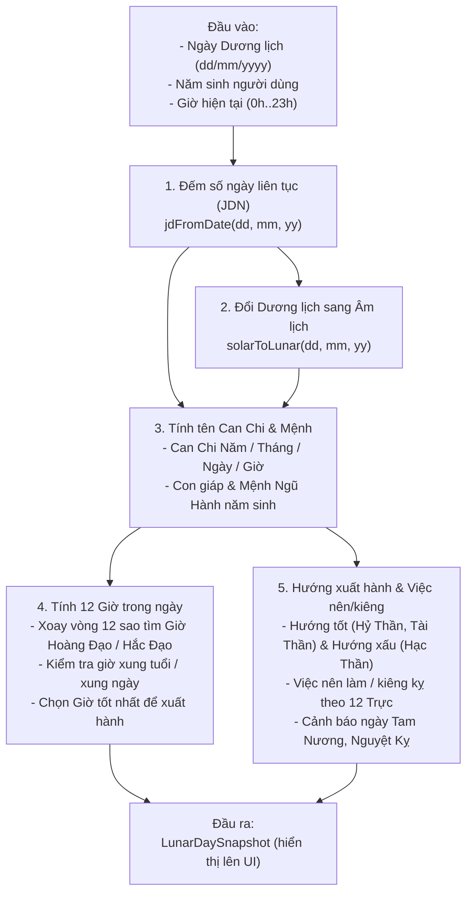

# Tài liệu Giải thích Logic & Công thức Tính Lịch Âm (`LunarService`)

- **File code chính**: [`LunarService.swift`](../../numelyra_app_ios/numelyra_app_ios/numelyra_app_ios/Core/Services/LunarService.swift), [`LunarCalendar.swift`](../../numelyra_app_ios/numelyra_app_ios/numelyra_app_ios/Shared/Models/LunarCalendar.swift), [`LunarClient.swift`](../../numelyra_app_ios/numelyra_app_ios/numelyra_app_ios/Core/Clients/LunarClient.swift)
- **File test tự động**: [`LunarServiceTests.swift`](../../numelyra_app_ios/numelyra_app_ios/numelyra_app_iosTests/LunarServiceTests.swift)
- **Mục đích**: Giải thích bằng ngôn ngữ dễ hiểu nhất **tại sao** cần từng hàm trong `LunarService`, **căn cứ thực tế** từ Lịch Vạn Niên Việt Nam, và **cách các công thức hoạt động từng bước**.

---

## 1. Tổng quan: `LunarService` làm nhiệm vụ gì?

Khi người dùng mở màn hình **Lịch Âm (Calendar)** hoặc **Tử Vi / Chiêm Tinh (Astrology)**, ứng dụng cần trả lời các câu hỏi quen thuộc của người Việt:
1. Hôm nay là ngày mấy Âm lịch? Tháng này đủ (30 ngày) hay thiếu (29 ngày)?
2. Ngày, tháng, năm, giờ hôm nay mang tên Can Chi là gì (ví dụ: *Giáp Thìn, Bính Dần...*)?
3. Người dùng sinh năm này thì cầm tinh con gì, thuộc mệnh gì (Kim, Mộc, Thủy, Hỏa, Thổ)?
4. Trong 12 khung giờ hôm nay, giờ nào là **Giờ Hoàng Đạo (giờ tốt)**, giờ nào là **Giờ Hắc Đạo (giờ xấu)**, và giờ nào hợp tuổi nhất để xuất hành?
5. Hôm nay đi hướng nào may mắn (**Hỷ Thần, Tài Thần**), tránh hướng nào xấu (**Hạc Thần**)?
6. Hôm nay nên làm việc gì và kiêng việc gì?

Ở bản React Native cũ (`lunarService.ts`), một số mục như hướng tốt hay việc nên làm chỉ lấy số ngày chia dư ngẫu nhiên (`jd % 8`, `jd % 6`). Sang bản iOS (`LunarService.swift`), toàn bộ được thay bằng **quy tắc tra cứu thực tế của Lịch Vạn Niên Việt Nam**.

### Sơ đồ luồng tính toán từ đầu vào đến đầu ra (`makeDaySnapshot`)



---

## 2. Bộ đếm ngày liên tục `JDN` và Đổi Dương lịch $\rightarrow$ Âm lịch

### 2.1. `JDN` (Số ngày Julian) là gì và tại sao phải dùng?
Nếu để ngày tháng ở dạng `dd/mm/yyyy`, máy tính rất khó cộng trừ khoảng cách giữa 2 ngày vì tháng Dương lịch dài ngắn thất thường (28, 29, 30, 31 ngày).

Vì vậy, các nhà thiên văn tạo ra **JDN (Julian Day Number)** — một **bộ đếm ngày liên tục như công-tơ-mét**:
- Ngày số `0` là ngày `01/01/4713 Trước Công Nguyên` (chọn mốc thật xa trong quá khứ để mọi ngày trong lịch sử đều là số dương).
- Cứ mỗi ngày trôi qua thì cộng thêm `1`, không cần biết tháng mấy hay năm nào.
  - Ví dụ: Ngày `10/02/2024` có `JDN = 2,460,351`. Ngày hôm sau `11/02/2024` có `JDN = 2,460,352`.

### 2.2. Giải thích công thức tính `jdFromDate(day: dd, month: mm, year: yy)`
```swift
let a = floorDiv(14 - mm, 12)
let y = yy + 4800 - a
let m = mm + 12 * a - 3
var jd = dd + floorDiv(153 * m + 2, 5) + 365 * y + floorDiv(y, 4) - floorDiv(y, 100) + floorDiv(y, 400) - 32045
```
Tại sao công thức lại viết như vậy?
1. **Dời đầu năm sang ngày 01/03 (biến `a, y, m`)**:
   - Tháng 2 là tháng duy nhất có 28 hoặc 29 ngày. Nếu đẩy **Tháng 1 và Tháng 2 xuống làm tháng cuối của năm trước đó**, thì ngày nhuận `29/02` sẽ nằm ở ngày cuối cùng của năm tính toán, không làm xê dịch các tháng khác.
   - `a = (14 - mm) / 12`: Chỉ bằng `1` khi là Tháng 1 hoặc Tháng 2; bằng `0` cho các tháng từ 3 đến 12.
   - `y = yy + 4800 - a`: Nếu là tháng 1 hoặc 2 (`a = 1`) thì lùi về năm trước (`yy - 1`), cộng thêm `4800` năm để số năm luôn dương.
   - `m = mm + 12*a - 3`: Đánh số lại tháng sao cho **Tháng 3 là `m = 0`**, Tháng 4 là `1`... và Tháng 2 là `m = 11`.
2. **Đếm ngày của các tháng trước bằng `(153 * m + 2) / 5`**:
   - Khi xếp từ Tháng 3 (`m = 0`), cứ 5 tháng liên tiếp (`31, 30, 31, 30, 31`) có tổng số ngày đúng bằng **`153` ngày**. Nhờ quy luật này, phép tính `(153 * m + 2) / 5` cho ra chính xác tổng số ngày của các tháng đứng trước mà không cần dùng lệnh `if/else`.
3. **Đếm ngày của các năm và năm nhuận**:
   - `365 * y`: Số ngày của các năm bình thường.
   - `+ y/4 - y/100 + y/400`: Cộng thêm số ngày nhuận `29/02` theo quy tắc lịch Dương (4 năm nhuận 1 lần, trừ năm chia hết cho 100, cộng lại năm chia hết cho 400).
   - `- 32045`: Trừ đi phần ngày cộng dư do lúc đầu ta đã cộng thêm `4800` năm vào `y`.

### 2.3. Cách đổi Dương lịch sang Âm lịch (`solarToLunar`) và tính Tháng Đủ / Tháng Thiếu (`isLunarMonthFull`)
Âm lịch dựa vào chu kỳ Mặt Trăng quay quanh Trái Đất:
- **Ngày Mùng 1 Âm lịch (Ngày Sóc — `getNewMoonDay`)**: Là ngày Mặt Trăng nằm giữa Trái Đất và Mặt Trời (không nhìn thấy trăng), tính theo múi giờ Việt Nam (`UTC+7`).
- **Biết hôm nay là mùng mấy Âm lịch**: Chỉ cần lấy số `JDN` của hôm nay trừ đi số `JDN` của ngày Mùng 1 Âm lịch gần nhất rồi cộng `1`:
  ```swift
  let lunarDay = dayNumber - monthStart + 1
  ```
- **Tại sao có Tháng Đủ (30 ngày) và Tháng Thiếu (29 ngày)?**
  Một vòng quay của Mặt Trăng mất trung bình **29,53 ngày** (khoảng 29 ngày 12 tiếng). Vì ngày lịch phải là số nguyên, nên khoảng cách giữa **ngày Mùng 1 tháng này (`nm1`)** và **ngày Mùng 1 tháng sau (`nm2`)** chỉ có thể là:
  - `nm2 - nm1 == 30 ngày` $\rightarrow$ **Tháng Đủ** (tháng đó có ngày 30 Âm lịch).
  - `nm2 - nm1 == 29 ngày` $\rightarrow$ **Tháng Thiếu** (tháng đó chỉ đến ngày 29 Âm lịch rồi sang Mùng 1 tháng mới luôn).

---

## 3. Cách tính tên Can Chi cho Năm – Tháng – Ngày – Giờ

Lịch truyền thống ghép **10 Thiên Can** (`Giáp, Ất, Bính, Đinh, Mậu, Kỷ, Canh, Tân, Nhâm, Quý`) với **12 Địa Chi / 12 Con Giáp** (`Tý, Sửu, Dần, Mão, Thìn, Tỵ, Ngọ, Mùi, Thân, Dậu, Tuất, Hợi`) để đặt tên cho Năm, Tháng, Ngày, Giờ.
- Ghép tuần tự 10 Can với 12 Chi sẽ tạo thành **60 cặp tên khác nhau** (bắt đầu từ `0: Giáp Tý` đến `59: Quý Hợi`), hết 60 cặp lại quay về `Giáp Tý`.

### 3.1. Can Chi của Năm (`getCanChiYear`)
- Năm Công nguyên thứ `4` là năm **Giáp Tý** (`can = 0, chi = 0`).
- Vì vậy, với bất kỳ năm Âm lịch nào, chỉ cần trừ đi `4` rồi chia lấy dư cho `10` và `12`:
  ```swift
  let canIdx = positiveMod(lunarYear - 4, 10)
  let chiIdx = positiveMod(lunarYear - 4, 12)
  ```

### 3.2. Can Chi của Tháng (`getCanChiMonth`) — Tại sao có `monthCanStart`?
Tên tháng Âm lịch gồm 2 chữ: **[Can] + [Chi]**.
- **Chữ Chi (con giáp) của tháng là CỐ ĐỊNH**: Tháng 1 (Tháng Giêng) luôn là tháng **Dần**, Tháng 2 là **Mão**, ..., Tháng 12 là **Sửu** (`chiIdx = (lunarMonth + 1) % 12`).
- **Chữ Can của tháng thì thay đổi theo năm**:
  Vì 1 năm có **12 tháng** nhưng chỉ có **10 Can**, nên khi đếm nối tiếp các tháng từ năm này sang năm khác, cứ hết 1 năm thì Can của Tháng 1 năm sau sẽ bị lệch tiến lên `12 % 10 = 2` bậc so với năm trước.
  - Năm Giáp (`yearCanIdx = 0`), Tháng 1 bắt đầu ở chữ **Bính (`2`)** $\rightarrow$ Tháng 1 là *Bính Dần*, đếm đến Tháng 12 là *Đinh Sửu (`3`)*.
  - Sang năm Ất kế tiếp (`yearCanIdx = 1`), Tháng 1 đếm nối tiếp từ *Đinh (`3`)* lên **Mậu (`4`)** $\rightarrow$ Tháng 1 là *Mậu Dần*.
- Do đó, công thức gồm 2 bước:
  ```swift
  // Bước 1: Tìm xem Tháng 1 của năm nay bắt đầu bằng chữ Can nào
  let monthCanStart = positiveMod(yearCanIdx * 2 + 2, 10)
  // Bước 2: Từ Tháng 1, đếm tiến thêm (lunarMonth - 1) bước để ra Can của tháng đang xem
  let canIdx = positiveMod(monthCanStart + lunarMonth - 1, 10)
  ```

### 3.3. Can Chi của Ngày (`getCanChiDay`)
Can Chi của ngày đếm liên tục ngày này qua ngày khác suốt hàng nghìn năm, hoàn toàn khớp với bộ đếm ngày liên tục `JDN`:
```swift
let canIdx = positiveMod(jd + 9, 10)           // Chữ Can của ngày (0..9)
let chiIdx = positiveMod(jd + 1, 12)           // Chữ Chi của ngày (0..11)
let sexagenaryIdx = positiveMod(jd + 49, 60)   // Vị trí của ngày trong vòng 60 cặp (0..59)
```

### 3.4. Can Chi của Giờ (`getCanChiHour`)
Giống hệt như tháng trong năm: 1 ngày có **12 khung giờ** (mỗi khung giờ dài 2 tiếng đồng hồ, bắt đầu từ Giờ Tý `23h-01h`), nhưng chỉ có **10 chữ Can**.
- Cứ hết 1 ngày (12 giờ), chữ Can của Giờ Tý ngày hôm sau lệch đi `2` bậc:
  ```swift
  // Bước 1: Tìm chữ Can của Giờ Tý (giờ đầu ngày) dựa vào chữ Can của Ngày
  let hourCanStart = positiveMod((dayCanIdx % 5) * 2, 10)
  // Bước 2: Đếm tiến thêm theo chỉ số giờ (0 = Tý, 1 = Sửu ... 11 = Hợi)
  let hourCanIdx = positiveMod(hourCanStart + hourChiIdx, 10)
  ```

---

## 4. Cách tính Mệnh Ngũ Hành theo Năm Sinh Âm Lịch (`extractBirthYear`, `getNapAm`, `getNguHanh`)

Khi hỏi *"Sinh ngày này thuộc tuổi con gì, mệnh gì (Kim, Mộc, Thủy, Hỏa, Thổ)?"*, quy tắc trong Lịch Vạn Niên hoạt động như sau:

0. **Đổi ngày sinh Dương lịch sang Năm sinh Âm lịch (`extractBirthYear`)**:
   - Nếu người dùng nhập ngày sinh Dương lịch (ví dụ `"1998-01-15"`), hàm `extractBirthYear` sẽ gọi `solarToLunar(day: 15, month: 1, year: 1998).year` trước tiên.
   - Nhờ vậy, người sinh vào tháng 1 hoặc đầu tháng 2 Dương lịch **trước Tết Nguyên Đán** (như `15/01/1998` Dương lịch tức `17/12/1997` Âm lịch) sẽ nhận đúng **năm sinh Âm lịch là `1997` (tuổi Sửu, mệnh Thủy)** chứ không bị nhầm sang năm `1998` (tuổi Dần, mệnh Thổ).
1. **Chu kỳ lặp lại là 60 năm Âm lịch**: Cứ đúng 60 năm thì tên năm và mệnh Ngũ Hành mới lặp lại một lần (ví dụ năm Âm lịch `1984` và `2044` cùng là năm *Giáp Tý*, cùng mệnh *Hải Trung Kim*).
2. **Cứ 2 năm Âm lịch liền nhau dùng chung 1 Mệnh**:
   - Năm `1984` (*Giáp Tý*) và `1985` (*Ất Sửu*) $\rightarrow$ cùng mệnh **Kim** (*Hải Trung Kim*).
   - Năm `1986` (*Bính Dần*) và `1987` (*Đinh Mão*) $\rightarrow$ cùng mệnh **Hỏa** (*Lư Trung Hỏa*).
   - Năm `1988` (*Mậu Thìn*) và `1989` (*Kỷ Tỵ*) $\rightarrow$ cùng mệnh **Mộc** (*Đại Lâm Mộc*).
   - Vì **60 năm** mà cứ **2 năm chung 1 mệnh**, nên tổng cộng có **$60 \div 2 = 30$ mệnh** được lưu theo thứ tự từ `0` đến `29` trong mảng `lucThapHoaGiapNapAm`.

### Giải thích 3 dòng công thức trong `getNapAm(birthYear:)`:
```swift
let sexagenaryIdx = positiveMod(birthYear - 4, 60)
let pairIdx = sexagenaryIdx / 2
return lucThapHoaGiapNapAm[pairIdx]
```
- **Tại sao lại `birthYear - 4`?**
  Vì cặp mệnh đầu tiên (vị trí `0`: *Giáp Tý – Ất Sửu*) rơi vào các năm Âm lịch `4, 64, ..., 1924, 1984, 2044` (chia 60 dư 4). Trừ đi `4` giúp đưa năm *Giáp Tý* về đúng vị trí mốc số `0`.
- **Tại sao lại `% 60`?**
  Vì cứ 60 năm vòng mệnh lặp lại từ đầu, chia lấy dư cho `60` sẽ rút gọn mọi năm sinh Âm lịch về một số thứ tự `sexagenaryIdx` từ **`0` đến `59`** (ví dụ: `1984` $\rightarrow$ `0`, `1985` $\rightarrow$ `1`, `1986` $\rightarrow$ `2`, `1987` $\rightarrow$ `3`...).
- **Tại sao lại chia đôi (`sexagenaryIdx / 2`)?**
  Trong lập trình, phép chia nguyên `/ 2` sẽ tự động làm tròn xuống, giúp **gom 2 năm liên tiếp vào cùng 1 chỉ số `pairIdx`** (từ `0` đến `29`):
  - Năm `1984` (`sexagenaryIdx = 0`) $\rightarrow 0 / 2 = \mathbf{0}$ $\rightarrow$ `lucThapHoaGiapNapAm[0]` (*Hải Trung Kim*)
  - Năm `1985` (`sexagenaryIdx = 1`) $\rightarrow 1 / 2 = \mathbf{0}$ $\rightarrow$ `lucThapHoaGiapNapAm[0]` (*Hải Trung Kim*)
  - Năm `1986` (`sexagenaryIdx = 2`) $\rightarrow 2 / 2 = \mathbf{1}$ $\rightarrow$ `lucThapHoaGiapNapAm[1]` (*Lư Trung Hỏa*)
  - Năm `1987` (`sexagenaryIdx = 3`) $\rightarrow 3 / 2 = \mathbf{1}$ $\rightarrow$ `lucThapHoaGiapNapAm[1]` (*Lư Trung Hỏa*)

*(Lưu ý: Bản cũ `lunarService.ts` vừa cắt thẳng 4 số đầu của năm Dương lịch, vừa chỉ nhìn vào chữ đầu của năm như `Giáp -> Mộc`, dẫn đến sai cả năm sinh trước Tết lẫn sai mệnh Ngũ Hành).*

---

## 5. Cách tính Giờ Hoàng Đạo / Giờ Hắc Đạo (`getHoangDaoHours`)

Một ngày được chia làm **12 khung giờ** (`0: Tý, 1: Sửu, 2: Dần, 3: Mão, 4: Thìn, 5: Tỵ, 6: Ngọ, 7: Mùi, 8: Thân, 9: Dậu, 10: Tuất, 11: Hợi`). Trong 12 giờ đó luôn có **6 Giờ Hoàng Đạo (giờ tốt)** và **6 Giờ Hắc Đạo (giờ xấu)**.

Cách tính hoạt động như **một vòng tròn 12 ngôi sao xoay trên mặt đồng hồ 12 giờ** qua 3 bước:

### Bước 1: Vòng 12 ngôi sao cố định (`twelveDayStars`)
Có 12 ngôi sao luôn đứng nối đuôi nhau theo thứ tự cố định từ `0` đến `11` (trong đó 6 sao tốt đánh dấu `true`, 6 sao xấu đánh dấu `false`):
- **`0`: Thanh Long (Hoàng Đạo — `true`)** $\leftarrow$ *Ngôi sao mốc số 0*
- **`1`: Minh Đường (Hoàng Đạo — `true`)**
- `2`: Thiên Hình (Hắc Đạo — `false`)
- `3`: Chu Tước (Hắc Đạo — `false`)
- **`4`: Kim Quỹ (Hoàng Đạo — `true`)**
- **`5`: Thiên Đức (Hoàng Đạo — `true`)**
- `6`: Bạch Hổ (Hắc Đạo — `false`)
- **`7`: Ngọc Đường (Hoàng Đạo — `true`)**
- `8`: Thiên Lao (Hắc Đạo — `false`)
- `9`: Huyền Vũ (Hắc Đạo — `false`)
- **`10`: Tư Mệnh (Hoàng Đạo — `true`)**
- `11`: Câu Trận (Hắc Đạo — `false`)

### Bước 2: Tính `thanhLongStart` — Xem hôm nay sao số `0` (`Thanh Long`) đặt ở giờ nào
Giờ bắt đầu của sao **Thanh Long** phụ thuộc vào **con giáp của Ngày hôm đó (`dayChiIdx`)** theo quy luật rất đều:
- Vào **Ngày Dần (`dayChiIdx = 2`)**, sao Thanh Long bắt đầu ở **Giờ Tý (`0`)**.
- Cứ mỗi khi con giáp của Ngày tăng lên `1` bậc, thì vị trí giờ của sao Thanh Long **nhảy tiến thêm `2` giờ** (chỉ rơi vào các giờ chẵn: `Tý 0 -> Dần 2 -> Thìn 4 -> Ngọ 6 -> Thân 8 -> Tuất 10`), hết 6 ngày lại lặp lại:

| Con giáp của Ngày (`dayChiIdx`) | Phép tính `(dayChiIdx * 2 + 8) % 12` | Giờ đặt sao `Thanh Long` (`thanhLongStart`) |
| :--- | :--- | :--- |
| **Ngày Tý (`0`), Ngọ (`6`)** | `(0 * 2 + 8) % 12 = 8` | **Giờ Thân (`8`)** |
| **Ngày Sửu (`1`), Mùi (`7`)** | `(1 * 2 + 8) % 12 = 10` | **Giờ Tuất (`10`)** |
| **Ngày Dần (`2`), Thân (`8`)** | `(2 * 2 + 8) % 12 = 0` | **Giờ Tý (`0`)** |
| **Ngày Mão (`3`), Dậu (`9`)** | `(3 * 2 + 8) % 12 = 2` | **Giờ Dần (`2`)** |
| **Ngày Thìn (`4`), Tuất (`10`)** | `(4 * 2 + 8) % 12 = 4` | **Giờ Thìn (`4`)** |
| **Ngày Tỵ (`5`), Hợi (`11`)** | `(5 * 2 + 8) % 12 = 6` | **Giờ Ngọ (`6`)** |

### Bước 3: Code đầy đủ từ lúc tìm `thanhLongStart` đến lúc lấy sao cho từng giờ (`idx = 0..11`)
```swift
// 1. Tìm con giáp của ngày hôm nay (0 = Tý, 1 = Sửu, ..., 11 = Hợi)
let dayChiIdx = getDayDiaChi(day: dd, month: mm, year: yy)

// 2. Tìm giờ bắt đầu của sao số 0 (Thanh Long) theo bảng tra (tương đương (dayChiIdx * 2 + 8) % 12)
let thanhLongStart = thanhLongStartHourByDayChi[dayChiIdx] ?? 0

// 3. Duyệt qua 12 giờ trong ngày (idx từ 0 = Giờ Tý đến 11 = Giờ Hợi):
//    Tính khoảng cách từ giờ thanhLongStart đến giờ idx để biết giờ đó gặp ngôi sao thứ mấy
let starOffset = positiveMod(idx - thanhLongStart, 12)
let star = twelveDayStars[starOffset]
// star.isHoangDao -> true (Giờ Hoàng Đạo) / false (Giờ Hắc Đạo)
// star.name       -> Tên ngôi sao của giờ đó ("Thanh Long", "Kim Quỹ", "Bạch Hổ"...)
```

---

## 6. Cách chọn "Giờ Tốt Nhất Để Xuất Hành" (`getBestDepartureHour`)

Không phải cứ Giờ Hoàng Đạo nào cũng tốt như nhau cho mọi người. Để chọn ra **1 khung giờ tốt nhất sắp tới trong ngày** cho người dùng, hàm `getBestDepartureHour` kết hợp thêm 2 bộ lọc:

1. **Tránh giờ xung khắc trực tiếp (`lucXung`)**:
   Trên vòng tròn 12 con giáp, 2 con giáp đứng đối diện nhau (cách nhau 6 vị trí) sẽ xung khắc trực tiếp với nhau (`Tý-Ngọ, Sửu-Mùi, Dần-Thân, Mão-Dậu, Thìn-Tuất, Tỵ-Hợi`).
   - `isClash`: Giờ xung với **tuổi của người dùng** (ví dụ người tuổi Tý tránh giờ Ngọ).
   - `isDayClash`: Giờ xung với **con giáp của chính ngày hôm đó** (ví dụ ngày Tý tránh giờ Ngọ).
2. **Tính cung xuất hành 6 trạng thái (`getLyThuanPhongHour`)**:
   Theo cách tính dân gian (Lý Thuần Phong), lấy `(Tháng Âm + Ngày Âm + Chỉ số Giờ - 2) % 6` để rơi vào 1 trong 6 trạng thái:
   - 3 trạng thái **Tốt**: `0: Đại An` (bình an), `2: Tốc Hỷ` (niềm vui nhanh), `4: Tiểu Cát` (may mắn).
   - 3 trạng thái **Xấu**: `1: Lưu Niên` (chậm trễ), `3: Xích Khẩu` (dễ cãi vã), `5: Không Vong` (hao công tốn sức).
3. **Thứ tự ưu tiên chọn giờ**:
   - Mỗi giờ được xét như một **khoảng hai tiếng**, không chỉ theo giờ bắt đầu. Riêng giờ Tý được tách thành `00:00-01:00` và `23:00-24:00` trong ngày dân dụng.
   - Nếu tất cả giờ phù hợp đã qua, hàm trả về `nil`, không quay lại gợi ý một giờ trong quá khứ.
   - **Ưu tiên 1 (Tốt nhất)**: Giờ Hoàng Đạo + Không xung tuổi + Không xung ngày + Trúng cung Lý Thuần Phong tốt (`Đại An, Tốc Hỷ, Tiểu Cát`).
   - **Ưu tiên 2**: Giờ Hoàng Đạo + Không xung tuổi + Không xung ngày.
   - **Ưu tiên 3**: Giờ Hoàng Đạo + Không xung tuổi.

---

## 7. Cách tính Hướng Xuất Hành Tốt & Xấu (`getDayDirection`, `getHacThanDirection`)

Mỗi ngày trong Lịch Vạn Niên có **2 hướng tốt nên đi** (**Hỷ Thần**, **Tài Thần**) và **1 hướng xấu nên tránh** (**Hạc Thần**). Dưới đây là cách tính từng bước trong code:

### 7.1. Cách tính 2 Hướng Tốt (`hyThan` & `taiThan`)
Hai hướng tốt chỉ phụ thuộc vào **chữ `Can` của Ngày hôm đó (`dayCanIdx` từ `0` đến `9`)**:

```swift
// Bước 1: Đổi ngày Dương lịch (dd, mm, yy) sang số ngày liên tục jd
let jd = jdFromDate(day: dd, month: mm, year: yy)

// Bước 2: Tìm chữ Can của ngày hôm nay (0 = Giáp, 1 = Ất, ..., 9 = Quý)
let dayCanIdx = positiveMod(jd + 9, 10)

// Bước 3: Lấy dayCanIdx tra vào 2 mảng hướng cố định (0..9)
let hyThan = hyThanByDayCan[dayCanIdx]   // Hướng may mắn, tin vui, cưới hỏi
let taiThan = taiThanByDayCan[dayCanIdx] // Hướng cầu tài, buôn bán, ký kết
```

**Tại sao bảng `hyThanByDayCan` và `taiThanByDayCan` lại có các hướng như vậy?**
- **Với Hướng Hỷ Thần**: Cứ cách 5 chữ Can (`dayCanIdx % 5`) thì lặp lại đúng 5 hướng theo thứ tự:
  - `0` (Giáp) & `5` (Kỷ) $\rightarrow$ **Đông Bắc**
  - `1` (Ất) & `6` (Canh) $\rightarrow$ **Tây Bắc**
  - `2` (Bính) & `7` (Tân) $\rightarrow$ **Tây Nam**
  - `3` (Đinh) & `8` (Nhâm) $\rightarrow$ **Chính Nam**
  - `4` (Mậu) & `9` (Quý) $\rightarrow$ **Đông Nam**
- **Với Hướng Tài Thần**: Xác định theo Ngũ Hành của chữ Can ngày hôm đó (ví dụ ngày Giáp/Ất thuộc Mộc, Mộc khắc Thổ sinh Tài ở hướng Đông Nam):

| `dayCanIdx` | Chữ Can của Ngày | Hướng Hỷ Thần (`hyThanByDayCan`) | Hướng Tài Thần (`taiThanByDayCan`) |
| :---: | :--- | :--- | :--- |
| `0` | **Giáp** | Đông Bắc | Đông Nam |
| `1` | **Ất** | Tây Bắc | Đông Nam |
| `2` | **Bính** | Tây Nam | Chính Đông |
| `3` | **Đinh** | Chính Nam | Chính Đông |
| `4` | **Mậu** | Đông Nam | Chính Bắc |
| `5` | **Kỷ** | Đông Bắc | Chính Nam |
| `6` | **Canh** | Tây Bắc | Tây Nam |
| `7` | **Tân** | Tây Nam | Tây Nam |
| `8` | **Nhâm** | Chính Nam | Chính Tây |
| `9` | **Quý** | Đông Nam | Tây Bắc |

---

### 7.2. Cách tính Hướng Xấu cần tránh (`hacThan` — `getHacThanDirection`)

Khác với Hỷ Thần và Tài Thần đổi hướng mỗi ngày theo 10 chữ Can, **Hạc Thần** đi vòng quanh 8 hướng trên la bàn theo **chu kỳ 60 ngày (`sexagenaryIdx` từ `0` đến `59`)**.

**Quy luật di chuyển của Hạc Thần trên la bàn:**
- Đi một vòng 8 hướng theo chiều kim đồng hồ: `Đông Bắc -> Chính Đông -> Đông Nam -> Chính Nam -> Tây Nam -> Chính Tây -> Tây Bắc -> Chính Bắc`.
- Cứ ở **hướng góc (Đông Bắc, Đông Nam, Tây Nam, Tây Bắc)** thì dừng lại **6 ngày**.
- Cứ ở **hướng thẳng (Chính Đông, Chính Nam, Chính Tây, Chính Bắc)** thì dừng lại **5 ngày**.
- Tổng cộng đi hết 8 hướng mất $(6 + 5) \times 4 = \mathbf{44\text{ ngày}}$.
- Còn lại **$60 - 44 = \mathbf{16\text{ ngày}}$** (từ ngày thứ `29` đến ngày thứ `44`), Hạc Thần "lên trời" (không đóng ở hướng nào dưới mặt đất), nên 16 ngày này **không có hướng xấu** (`return nil`).

**Code tính toán trong `getHacThanDirection`:**
```swift
// Bước 1: Tính xem hôm nay là ngày thứ mấy trong vòng 60 ngày (0 = Giáp Tý ... 59 = Quý Hợi)
// (Cộng 49 vì ngày gốc jd = 0 rơi vào ngày thứ 49 trong vòng 60 ngày)
let jd = jdFromDate(day: dd, month: mm, year: yy)
let sexagenaryIdx = positiveMod(jd + 49, 60)

// Bước 2: Kiểm tra sexagenaryIdx rơi vào khoảng ngày nào trong 60 ngày
switch sexagenaryIdx {
case 29...44:        return nil          // 16 ngày không có hướng xấu
case 45...50:        return "Đông Bắc"   // 6 ngày ở hướng góc Đông Bắc
case 51...55:        return "Chính Đông" // 5 ngày ở hướng thẳng Chính Đông
case 56...59, 0...1: return "Đông Nam"   // 6 ngày ở hướng góc Đông Nam
case 2...6:          return "Chính Nam"  // 5 ngày ở hướng thẳng Chính Nam
case 7...12:         return "Tây Nam"    // 6 ngày ở hướng góc Tây Nam
case 13...17:        return "Chính Tây"  // 5 ngày ở hướng thẳng Chính Tây
case 18...23:        return "Tây Bắc"    // 6 ngày ở hướng góc Tây Bắc
case 24...28:        return "Chính Bắc"  // 5 ngày ở hướng thẳng Chính Bắc
default:             return nil
}
```

---

## 8. Cách tính Việc Nên Làm / Kiêng Kỵ (`getDayActivities` & `getDayWarning`)

### 8.1. 12 Trực của ngày (`thapNhiKienTru`)
Để biết một ngày thích hợp làm việc gì (khai trương, cưới hỏi, ký kết hay dọn dẹp, nghỉ ngơi), Lịch Vạn Niên dùng vòng **12 Trực** (`Kiến, Trừ, Mãn, Bình, Định, Chấp, Phá, Nguy, Thành, Thu, Khai, Bế`):
- 12 Trực dùng **tháng tiết khí (nguyệt kiến)**, không đổi theo ngày mùng 1 âm lịch: tháng Dần bắt đầu từ Lập Xuân, tháng Mão từ Kinh Trập, ..., tháng Sửu từ Tiểu Hàn.
- Ngày có **Địa Chi ngày trùng Địa Chi tháng tiết khí** bắt đầu ở vị trí số `0` (**Trực Kiến**).
- `getSolarMonthDiaChiIndex` xét kinh độ Mặt Trời ở cuối ngày địa phương để ngày nhập tiết là ngày đầu tháng tiết; nhờ vậy Trực của ngày nhập tiết lặp lại ngày trước đó theo quy tắc Kiến Trừ.
- Các ngày tiếp theo chỉ việc đếm tiến lên theo công thức:
  ```swift
  let monthChiIdx = getSolarMonthDiaChiIndex(day: dd, month: mm, year: yy)
  let trucIdx = positiveMod(dayChiIdx - monthChiIdx, 12)
  let truc = thapNhiKienTru[trucIdx]
  ```
- Mỗi Trực trong bảng `thapNhiKienTru` đã định nghĩa sẵn danh sách **Việc nên làm (`yi`)** và **Việc không nên làm (`ji`)** đúng với tính chất của ngày đó.

### 8.2. Cảnh báo ngày kỵ dân gian (`getDayWarning`)
Ngoài 12 Trực, dân gian Việt Nam kiêng khởi sự lớn vào 2 nhóm ngày Âm lịch cố định hàng tháng:
- **Ngày Nguyệt Kỵ** (`mùng 5, 14, 23 Âm lịch` — câu tục ngữ *"Mùng năm, mười bốn, hai ba"*).
- **Ngày Tam Nương** (`mùng 3, 7, 13, 18, 22, 27 Âm lịch`).

---

## 9. Bảng tóm tắt so sánh Bản cũ (RN) & Bản mới (iOS)

| Tính năng | Bản cũ (`lunarService.ts`) | Bản mới (`LunarService.swift`) |
| :--- | :--- | :--- |
| **Mệnh Ngũ Hành năm sinh** | Chỉ lấy theo chữ đầu của năm (`Giáp/Ất -> Mộc`), dẫn đến sai mệnh | Tra đúng bảng **30 cặp mệnh** theo chu kỳ 60 năm (ví dụ 1998 Mậu Dần $\rightarrow$ *Thành Đầu Thổ*) |
| **Tên sao của 12 Giờ** | Gán tên sao cố định từ Giờ Tý khiến 10/12 ngày bị lệch tên sao | Đặt sao **Thanh Long** đúng giờ theo con giáp của ngày rồi xoay vòng 12 sao |
| **Giờ xuất hành tốt nhất** | Duyệt từ đầu mảng khiến Giờ Tý (`23h` đêm) bị chọn nhầm vào buổi sáng | Xét đúng khoảng 2 tiếng, tách hai phần giờ Tý, lọc theo 3 mức ưu tiên và không trả giờ đã qua |
| **Hướng xuất hành** | Chia dư giả lập `jd % 8` | Tra đúng **Hướng Hỷ Thần**, **Hướng Tài Thần** (theo Can ngày) và **Hướng xấu Hạc Thần** (theo 60 ngày) |
| **Việc nên / không nên làm** | Chia dư giả lập `jd % 6` | Tính theo **12 Trực** từ độ lệch giữa Địa Chi ngày và tháng tiết khí (nguyệt kiến) |
