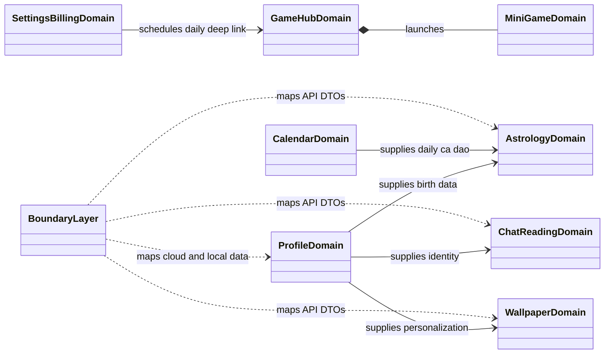
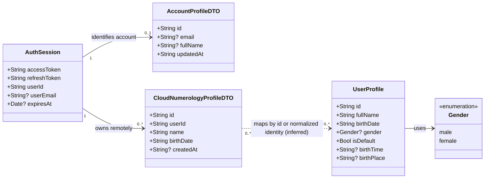
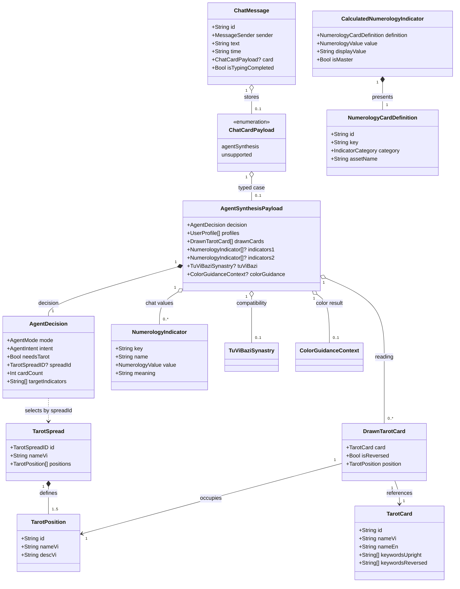
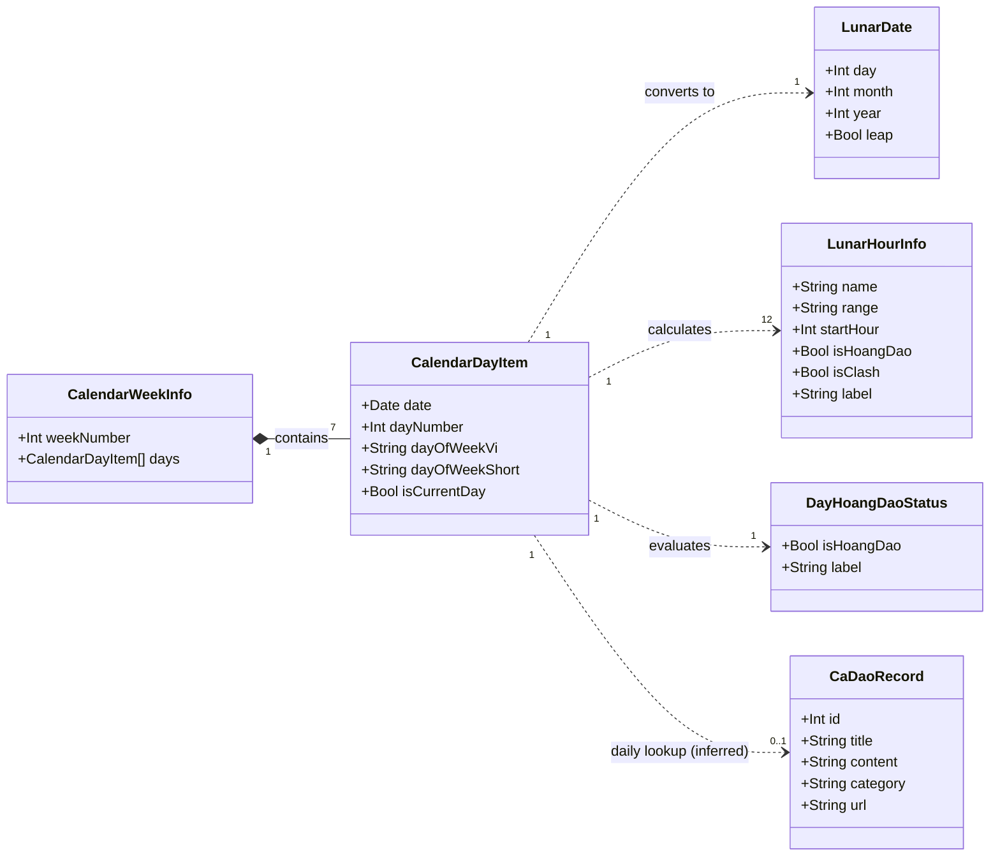
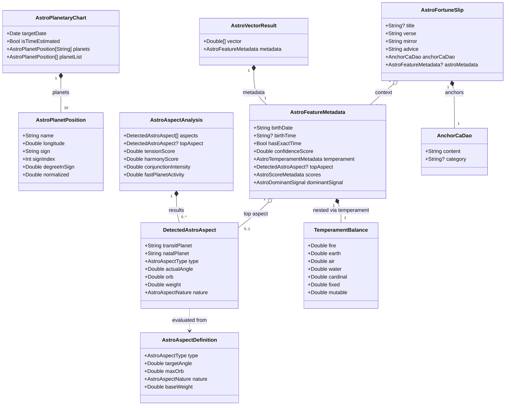
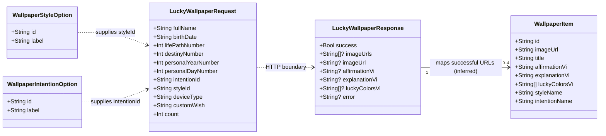
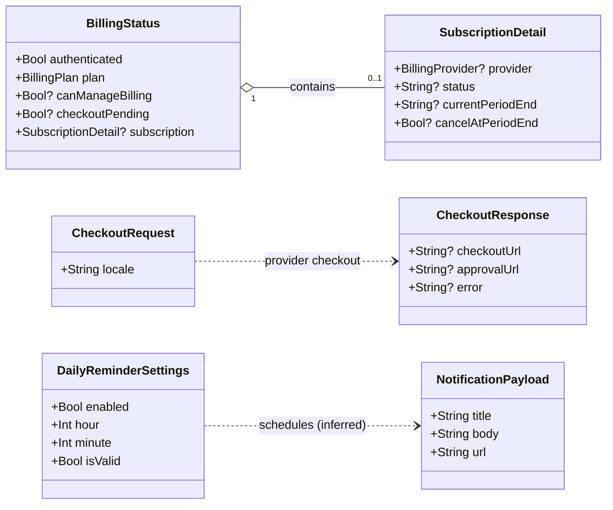
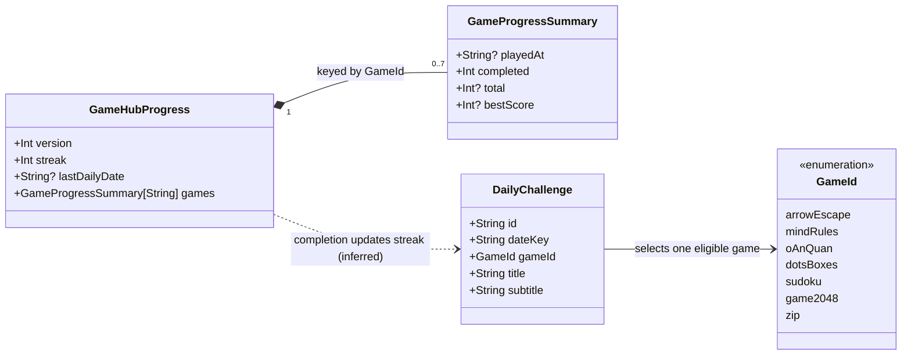
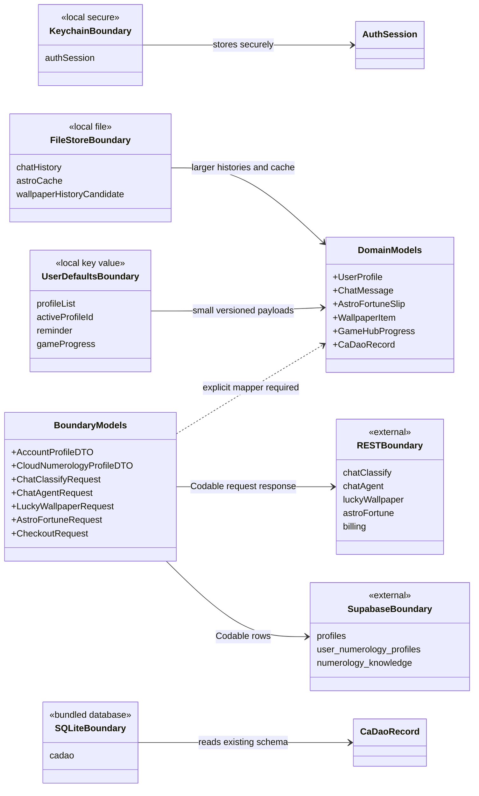

# Class diagrams cho model Swift đích

Tài liệu này mô tả model đích trong `numelyra_app_ios/Shared/Models` sau khi đối chiếu source React Native tại ref `b89d94fdbee6118edca8c09d9232115da081afb9`. Có đúng **10 Mermaid class diagram**: 1 overview và 9 sơ đồ domain/boundary. Dấu `?` biểu thị optional; quan hệ có nhãn `inferred` được giải thích ngay dưới sơ đồ.

## 0. Tổng quan kiến trúc dữ liệu

Các cạnh trong overview là dependency giữa domain, không phải cardinality của record. Evidence: `App.tsx:80-101`, `ChatScreen.tsx:1010-1185`, `astroFortuneService.ts:76-150`, `GameHubScreen.tsx:45-130`.

## 1. App shell, authentication và profile

Quan hệ inferred phản ánh merge cloud/local trong `src/store/authContext.tsx:38-124`. Cloud row không có `gender`, `birthTime`, `birthPlace` hoặc `isDefault`; mapper phải áp dụng policy rõ ràng thay vì coi hai schema là cùng một model. Swift: `UserProfile.swift`, `BoundaryModels.swift`.

## 2. Numerology, Tarot và Chat

`IndicatorInfo` và `CalculatedIndicator` được giữ thành hai model Swift riêng, thay vì trộn field của hai schema. Evidence: `numerology24Service.ts:52-57`, `numerologyEngine.ts:85-89`, `ChatScreen.tsx:813-849`. Swift: `Numerology.swift`, `Tarot.swift`, `AgentDecision.swift`, `ChatMessage.swift`.

## 3. Calendar và dữ liệu văn hóa

Quan hệ ca dao là inferred từ ngày được truyền vào `getDailyCaDao`. Thuật toán parity bắt buộc là `seed = day * 31 + month * 37 + year * 7`, sau đó `ORDER BY id LIMIT 1 OFFSET seed % total` (`src/db/cadaoService.ts:94-120`). Swift: `LunarCalendar.swift`.

## 4. Astrology

Metadata giữ đủ temperament, top aspect, score và dominant signal theo `astroVectorEngine.ts:28-73`; bản cũ trong iOS đã bỏ các field này. `float32Array` là derived runtime representation nên Swift chỉ persist `[Double]` và cung cấp computed `[Float]`. Swift: `Astrology.swift`.

## 5. Wallpaper Studio

Quan hệ response-to-item là inferred từ mapper tại `WallpaperStudioScreen.tsx:466-486`; server có thể trả một URL hoặc mảng URL. Persistence của `WallpaperItem` vẫn là quyết định sản phẩm mở, không được thể hiện như hành vi parity đã tồn tại. Swift: `Wallpaper.swift`, `BoundaryModels.swift`.

## 6. Settings, notification và billing

Quan hệ notification là inferred từ `dailyNotifications.ts:46-64`; payload mở deep link `numelyra://games/daily`. Coding keys snake_case của subscription được khai báo rõ trong Swift. Swift: `Billing.swift`, `BoundaryModels.swift`.

## 7. Game Hub và progress dùng chung

Quan hệ inferred được thực thi bởi `completeDailyChallenge` tại `gameHubStorage.ts:42-54`: cùng ngày không tăng lại, ngày kế tiếp tăng streak, ngày đứt quãng reset về 1. Swift: `GameHubModels.swift`.

## 8. Model riêng của các mini-game

```mermaid
classDiagram
    direction TB
    class ArrowEscape_Level {
        +Int id
        +ArrowEscape_Difficulty difficulty
        +ArrowEscape_GridSize gridSize
        +ArrowEscape_Arrow[] arrows
    }
    class ArrowEscape_Arrow {
        +String id
        +ArrowEscape_GridPosition[] path
        +ArrowEscape_GridPosition[] fullPath
    }
    class ArrowEscape_Board {
        +ArrowEscape_Level level
        +ArrowEscape_Arrow[] arrows
        +Int livesLeft
        +String[] removedIds
    }
    class ArrowEscape_Progress
    class SpaceGame_MiniBoard {
        +Int columns
        +Int rows
        +SpaceGame_MiniArrow[] arrows
    }
    class SpaceGame_MiniArrow {
        +String id
        +SpaceGame_AmmoType ammoType
    }
    class SpaceGame_State
    class MindRules_Puzzle {
        +Int id
        +MindRules_Equation[] equations
        +Int question
        +Int answer
    }
    class MindRules_Equation
    class OAnQuan_State {
        +OAnQuan_Cell[] cells
        +OAnQuan_Score[] scores
        +OAnQuan_Winner? winner
    }
    class OAnQuan_Cell
    class OAnQuan_Score
    class DotBox_State {
        +DotBox_Line[String] lines
        +DotBox_Box[] boxes
        +Int[] scores
    }
    class DotBox_Line
    class DotBox_Box
    class Sudoku_Board {
        +Sudoku_Cell[][] rows
    }
    class Sudoku_Cell
    class Game2048_Cell
    class Game2048_BestTileProgress
    class Zip_Puzzle {
        +Zip_Checkpoint[] checkpoints
        +Zip_Wall[]? walls
        +Zip_CellPosition[] solution
    }
    class Zip_Checkpoint
    class Zip_Wall
    class Zip_Progress
    class Zip_BestResult

    ArrowEscape_Level "1" *-- "1..*" ArrowEscape_Arrow : defines
    ArrowEscape_Board "1" --> "1" ArrowEscape_Level : current level
    ArrowEscape_Board "1" *-- "0..*" ArrowEscape_Arrow : remaining
    ArrowEscape_Progress ..> ArrowEscape_Level : restores level by id
    SpaceGame_MiniBoard "1" *-- "0..*" SpaceGame_MiniArrow : reload puzzle
    SpaceGame_State ..> SpaceGame_MiniBoard : consumes solved board
    MindRules_Puzzle "1" *-- "1..*" MindRules_Equation : examples
    OAnQuan_State "1" *-- "12" OAnQuan_Cell : board
    OAnQuan_State "1" *-- "2" OAnQuan_Score : players
    DotBox_State "1" *-- "0..*" DotBox_Line : edges
    DotBox_State "1" *-- "0..*" DotBox_Box : cells
    Sudoku_Board "1" *-- "81" Sudoku_Cell : 9 by 9
    Zip_Puzzle "1" *-- "1..*" Zip_Checkpoint : ordered checkpoints
    Zip_Puzzle "1" *-- "0..*" Zip_Wall : boundaries
    Zip_Progress "1" *-- "0..*" Zip_BestResult : keyed by puzzle id
```

Tên Mermaid được làm phẳng từ namespace Swift (`ArrowEscapeModels.Level`, `ZipModels.Puzzle`, v.v.) để tránh xung đột `Direction`, `Difficulty`, `Board` và `Puzzle`. Chỉ tree reachable được port: DotBox dưới `o-an-quan/src/dotbox`, không phải standalone duplicate `games/dots-boxes`. Swift: `MiniGameModels.swift`.

## 9. API và storage boundary

`SwiftData` không được coi là reader thay thế trực tiếp cho bundled `cadao.db`; boundary này phải dùng SQLite3 hoặc GRDB. Các key React Native cần được giữ trong migration adapter trước khi đổi tên. `ChatCardPayload.unsupported(JSONValue)` bảo toàn payload cũ không nhận diện được thay vì silently biến thành `{}`. Swift: `BoundaryModels.swift`, `ChatMessage.swift`.

## Kiểm chứng

- Số Mermaid block: 10.
- Mỗi inferred relationship đều có giải thích ngay sau diagram.
- Optionality quan trọng được biểu diễn bằng `?`.
- Tên trùng giữa các mini-game được namespace trong Swift và làm phẳng có tiền tố trong Mermaid.
- Mermaid CLI không có trong môi trường hiện tại; cú pháp được kiểm tra tĩnh theo `classDiagram` grammar.
