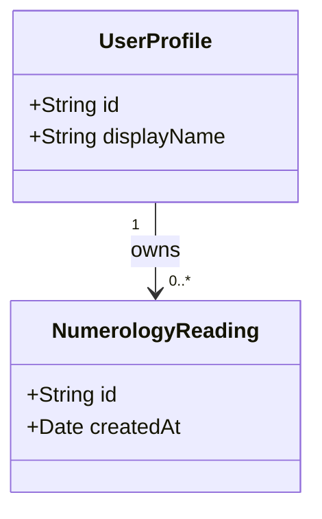

# Prompt — Audit model và xây dựng class diagram

Bạn đang làm việc tại repository `/Users/manhle/numelyra_clone` để chuyển ứng dụng React Native `numelyra_app/` sang Swift native trong `numelyra_app_ios/`.

## Mục tiêu

Đọc và audit toàn bộ source code thực tế của dự án React Native, lập inventory đầy đủ cho các model đang tồn tại, sau đó xây dựng class diagram có thể dùng làm nền tảng thiết kế model Swift. Không chỉ lập kế hoạch: hãy thực hiện audit, tạo tài liệu và kiểm chứng kết quả.

## Quy tắc bắt buộc

1. Đọc đầy đủ các file sau trước khi audit:
   - `/Users/manhle/numelyra_clone/AGENTS.md`
   - `/Users/manhle/numelyra_clone/migration/README.md`
   - `/Users/manhle/numelyra_clone/migration/STATUS.md`
   - Các báo cáo hiện có trong `/Users/manhle/numelyra_clone/migration/inventory/`.
2. Xem `numelyra_app/` là source tham chiếu chỉ đọc. Không sửa, format, restore asset hoặc cài dependency trong dự án React Native.
3. Đọc source thực tế thay vì chỉ dựa vào README hoặc tên file. Quét toàn bộ file liên quan, bao gồm `.ts`, `.tsx`, SQL/migration, JSON/config, service, test/fixture và schema database nếu có.
4. Ghi lại commit/ref và trạng thái working tree trước khi audit. Phân biệt rõ code reachable với test-only, legacy, duplicate hoặc dormant.
5. Không tự suy đoán field hoặc relationship. Mọi kết luận phải có đường dẫn source và dòng tham chiếu. Điều chưa xác định phải ghi `Unknown` cùng lý do.
6. Chỉ tạo hoặc cập nhật tài liệu trong `migration/`. Không viết model Swift và không thay đổi feature trong lượt này.

## Những loại model phải tìm

Không chỉ tìm từ khóa `interface`, `type` hoặc `class`. Phải nhận diện cả cấu trúc dữ liệu được khai báo gián tiếp hoặc suy ra từ nơi đọc/ghi:

- Domain model và value object.
- API request, response, DTO và payload streaming.
- Supabase table/row, RPC payload, auth/session/profile record.
- AsyncStorage key và cấu trúc JSON được serialize.
- SQLite table/entity/query result.
- App state, navigation state và UI state có ý nghĩa nghiệp vụ.
- Config/definition model như numerology cards, Tarot cards, game definition và calendar data.
- Event, notification payload, deep-link payload và billing payload.
- Model nằm trong từng game, bao gồm board, level, progress, score và persisted session.
- Type được tạo từ object literal, mapper, factory, parser, reducer hoặc service dù không có khai báo model riêng.

Không coi props thuần trình bày của component là domain model. Nếu một type vừa là UI state vừa chứa dữ liệu nghiệp vụ, phải ghi rõ ranh giới và đề xuất tách khi chuyển sang Swift.

## Phân loại bắt buộc

Gắn mỗi model vào một trong các nhóm sau:

- `DomainModel`
- `ValueObject`
- `APIRequest`
- `APIResponse`
- `PersistenceEntity`
- `UIState`
- `Configuration`
- `EventPayload`
- `LegacyOrDormant`

Với mỗi model, ghi:

- Tên hiện tại và tên Swift đề xuất.
- Nhóm/feature sở hữu model.
- File và dòng khai báo hoặc nơi cấu trúc được suy ra.
- Field, kiểu dữ liệu, optionality và default quan trọng.
- Enum/union value hợp lệ.
- Quan hệ với model khác và cardinality.
- Nơi tạo, nơi biến đổi và nơi tiêu thụ.
- Biên serialize: API, Supabase, AsyncStorage, SQLite hoặc in-memory.
- Quy tắc validation/computed field/derived value.
- Trạng thái reachable, test-only, legacy, duplicate hoặc unknown.
- Đề xuất Swift: `struct`, `enum`, value object, `Codable`, `Identifiable`, persistence entity hoặc TCA state.
- Mức tin cậy: `High`, `Medium` hoặc `Low`.

## Phân tích quan hệ

Phải thể hiện được:

- Composition/ownership.
- Association và dependency dữ liệu.
- One-to-one, one-to-many và many-to-many.
- Inheritance/protocol nếu source thực sự có.
- Mapping giữa DTO, domain model và persistence entity.
- Model dùng chung giữa nhiều feature.
- Luồng biến đổi dữ liệu từ network/storage tới domain rồi tới UI state.

Không dùng inheritance trong sơ đồ chỉ để biểu diễn việc hai type có field giống nhau.

## Class diagram

Dùng Mermaid `classDiagram`. Không tạo một sơ đồ khổng lồ duy nhất. Tạo một overview cấp domain và các sơ đồ chi tiết tối thiểu cho:

1. App shell, authentication, session và profile.
2. Numerology, Tarot và Chat.
3. Calendar và dữ liệu văn hóa.
4. Astrology.
5. Wallpaper Studio.
6. Settings, notification và billing.
7. Game Hub và progress dùng chung.
8. Từng mini-game có model riêng.
9. API/storage boundary dùng chung.

Mỗi class trong Mermaid phải khớp với một entry trong model catalog. Dùng tên ổn định, tránh ký tự khiến Mermaid lỗi. Ghi cardinality trên relationship khi source đủ bằng chứng. Relationship suy luận phải có nhãn `inferred` và được giải thích ngay dưới sơ đồ.

Ví dụ ký hiệu:

Ví dụ chỉ minh họa cú pháp, không được coi là bằng chứng về model thật.

## File đầu ra

Tạo thư mục `/Users/manhle/numelyra_clone/migration/inventory/models/` và các file:

1. `README.md`
   - Phạm vi audit, commit/ref, phương pháp, số file đã quét.
   - Thống kê model theo nhóm và domain.
   - Coverage matrix theo feature.
   - Danh sách file/domain chưa đọc được hoặc còn không chắc chắn.
2. `MODEL_CATALOG.md`
   - Inventory chi tiết cho từng model.
   - Dẫn chứng bằng đường dẫn repository-relative kèm số dòng.
   - Bảng duplicate/overlap và model cần tách hoặc hợp nhất khi sang Swift.
3. `CLASS_DIAGRAMS.md`
   - Overview diagram và các Mermaid diagram theo domain nêu trên.
   - Giải thích relationship phức tạp hoặc inferred ngay dưới từng sơ đồ.
4. `SWIFT_MODEL_MAP.md`
   - Mapping từ model React Native sang model Swift đề xuất.
   - Module/feature đích, protocol cần conform, chiến lược Codable và persistence.
   - Không viết implementation Swift trong file này.
5. `OPEN_QUESTIONS.md`
   - Gap, conflict, schema drift, field không được dùng, payload không có type và quyết định cần xác nhận.
   - Mỗi câu hỏi phải nêu ảnh hưởng nếu chọn sai.

Sau khi hoàn tất, cập nhật `/Users/manhle/numelyra_clone/migration/STATUS.md` với ngày audit, kết quả, đường dẫn báo cáo và blocker mới. Không đánh dấu một feature là đã migrate chỉ vì model đã được audit.

## Cách kiểm chứng

- Đếm và báo cáo số file source đã quét, số model tìm thấy và số model theo từng nhóm.
- Tìm lại toàn repository để bảo đảm mọi exported `type`, `interface`, `class`, `enum`, storage payload và API DTO quan trọng đều được phân loại hoặc giải thích vì sao loại bỏ.
- Đối chiếu model catalog với class diagram: không được có class mồ côi hoặc relationship không có bằng chứng.
- Kiểm tra cú pháp Mermaid bằng công cụ có sẵn. Nếu không có Mermaid CLI, tự kiểm tra block, tên class và relationship rồi ghi rõ giới hạn kiểm chứng.
- Kiểm tra link/file/line evidence còn tồn tại.
- Xác nhận `git diff` không chứa thay đổi trong `numelyra_app/` hoặc `numelyra_app_ios/`.

## Definition of Done

Chỉ hoàn tất khi:

- Tất cả domain reachable trong feature inventory đều có coverage.
- Model catalog, class diagrams và Swift mapping nhất quán với nhau.
- DTO/domain/persistence/UI state được phân biệt rõ.
- Duplicate, legacy và inferred model được đánh dấu, không bị trình bày như sự thật chắc chắn.
- Mọi model quan trọng đều có source evidence.
- `STATUS.md` đã được cập nhật.

## Cách báo cáo cuối cùng

Trả lời ngắn gọn bằng tiếng Việt, gồm:

- Tổng số file và model đã audit.
- Các domain đã có diagram.
- Các file báo cáo đã tạo.
- Những gap/blocker quan trọng nhất.
- Kết quả kiểm chứng và xác nhận không sửa source React Native/Swift.
